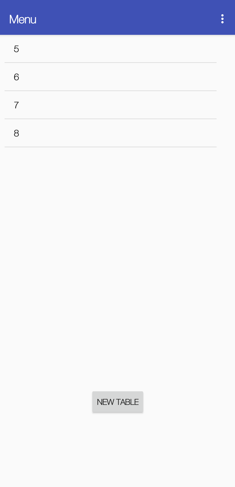
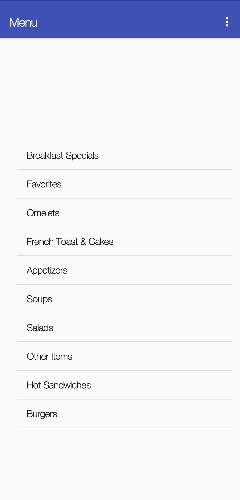
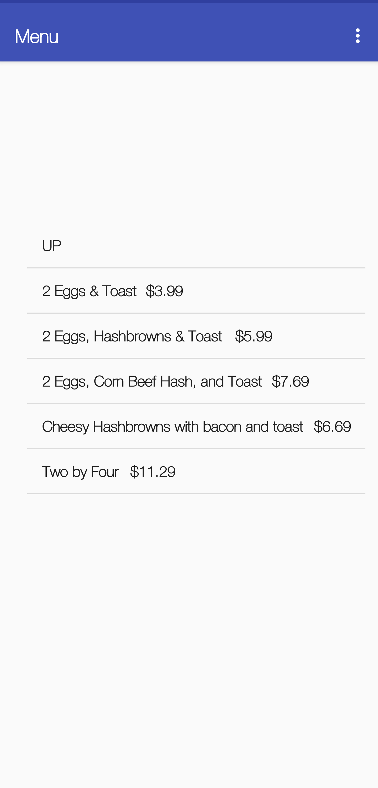
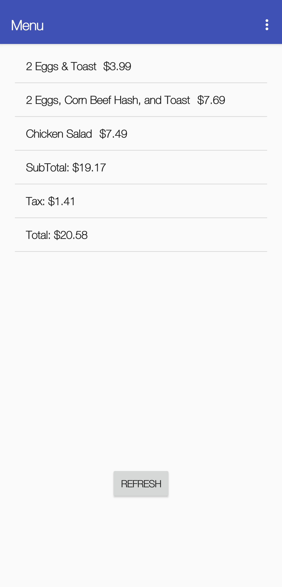

# Lakes Cafe Ticket Calculator

Calculate totals for customers from the [Lakes Cafe Website & API](http://lakescafe.herokuapp.com)

## Why create this?

While I was a server, we had to share a small space, two menu to find item prices, and share two calculators across 5 servers. During rush times, it was difficult to share the space and calculators (especially when we had multiple tickets to calculate). This solution pulls data from the API and adds the local tax rate so we don't need to.

- Scan the menu to verify prices
- Manually type in prices into a calculator

It was a cool idea and this was distributed to two other servers, but the old website & API is no longer being maintained.

## App Walkthrough

First, create a table

Second, swipe left to the categories and select items to add to a table

Last, swipe to the ticket totals and calculated subtotal and translate to a written ticket

